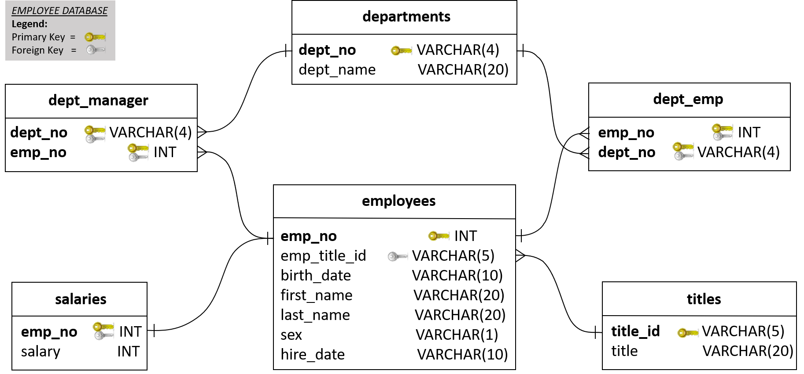

# Employee Database: A Mystery in Two Parts
This project builds a SQL database of employees of a corporation called Pewlett Hackard from the 1980s and 1990s. For this, an Entity Relationship Diagram is first created, and Data Engineering and Data Analysis is then performed on six CSV files containing various kinds of employee data. The SQL tables are designed, data in CSVs are imported into a SQL database, and finally, the data is analysed by answering a series of questions.

## Analysis
Once the database was complete, queries were run to answer the following employee-related questions:

1. List the following details of each employee: employee number, last name, first name, sex, and salary.

2. List first name, last name, and hire date for employees who were hired in 1986.

3. List the manager of each department with the following information: department number, department name, the manager's employee number, last name, first name.

4. List the department of each employee with the following information: employee number, last name, first name, and department name.

5. List first name, last name, and sex for employees whose first name is "Hercules" and last names begin with "B."

6. List all employees in the Sales department, including their employee number, last name, first name, and department name.

7. List all employees in the Sales and Development departments, including their employee number, last name, first name, and department name.

8. In descending order, list the frequency count of employee last names, i.e., how many employees share each last name.

## List of Contents
- An image file of the ERD (ERD.png).
- A .sql file of your table schemata (Data Engineering/schema.sql).
- A .sql file of your queries (Datanalysis/data_analysis.sql).
- (Optional) A Jupyter Notebook of the bonus analysis.

## Technologies
- PostgresSQL 12
- pgAdmin 4
- Python 3.7.8
- Pandas 20.1.1
- Numpy 1.18.5
- Jupyter Notebook

## Contact
Created by [@iCode13](https://github.com/iCode13) - please feel free to contact me with any questions on this project.