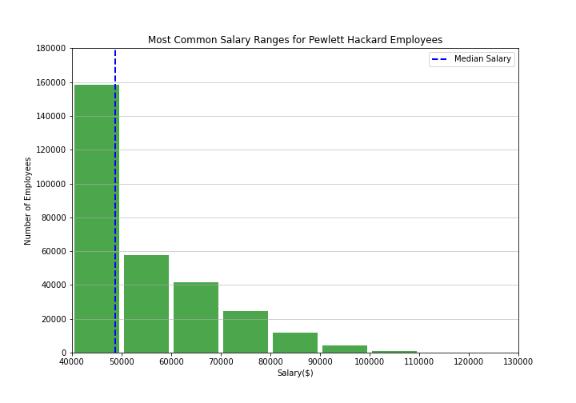
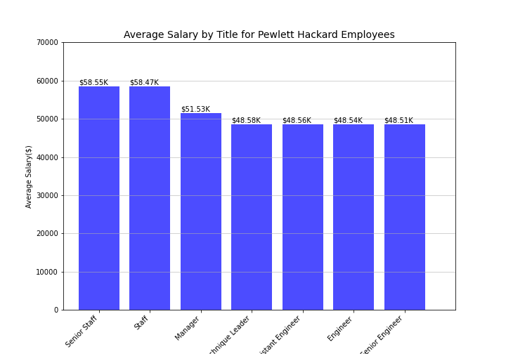

# Employee Database: A Mystery in Two Parts
This project builds a SQL database of employees of a corporation called Pewlett Hackard from the 1980s and 1990s. For this, an Entity Relationship Diagram is first created, and Data Engineering and Data Analysis is then performed on six CSV files containing various kinds of employee data. The SQL tables are designed, data in CSVs are imported into a SQL database, and finally, the data is analysed by querying the data and answering a series of questions.

* Note: Any user running this code must use their own Postgres details in order to successfully connect to their database (config.py template file provided).

## Analyses
Once the database was complete, query runs included:

1. Listed the following details of each employee: employee number, last name, first name, sex, and salary.

2. Listed first name, last name, and hire date for employees who were hired in 1986.

3. Listed the manager of each department with the following information: department number, department name, the manager's employee number, last name, first name.

4. Listed the department of each employee with the following information: employee number, last name, first name, and department name.

5. Listed first name, last name, and sex for employees whose first name is "Hercules" and last names begin with "B."

6. Listed all employees in the Sales department, including their employee number, last name, first name, and department name.

7. Listed all employees in the Sales and Development departments, including their employee number, last name, first name, and department name.

8. In descending order, listed the frequency count of employee last names, i.e., how many employees share each last name.

Bonus: Further analyses revealed the following information about employee earnings at the company -

1. Most employees of the company earn in the $40K-50K range, with median earnings close to $50K annually.

2. Staff and Senior Staff have the highest average annual salary of ~58K.

## List of Contents
* An image file of the ERD (ERD.png).
* A .sql file of your table schemata (Data Engineering/schema.sql).
* A .sql file of your queries (Datanalysis/data_analysis.sql).
* A Jupyter Notebook of the bonus analyses.

## Technologies
* PostgresSQL 12
* pgAdmin 4.26
* SQLalchemy 1.3.19
* Python 3.7.8
* Pandas 20.1.1
* NumPy 1.18.5
* Matplotlib 3.3.0
* Jupyter Notebook

## Contact
Created by [@iCode13](https://github.com/iCode13) - please contact with questions/comments.
